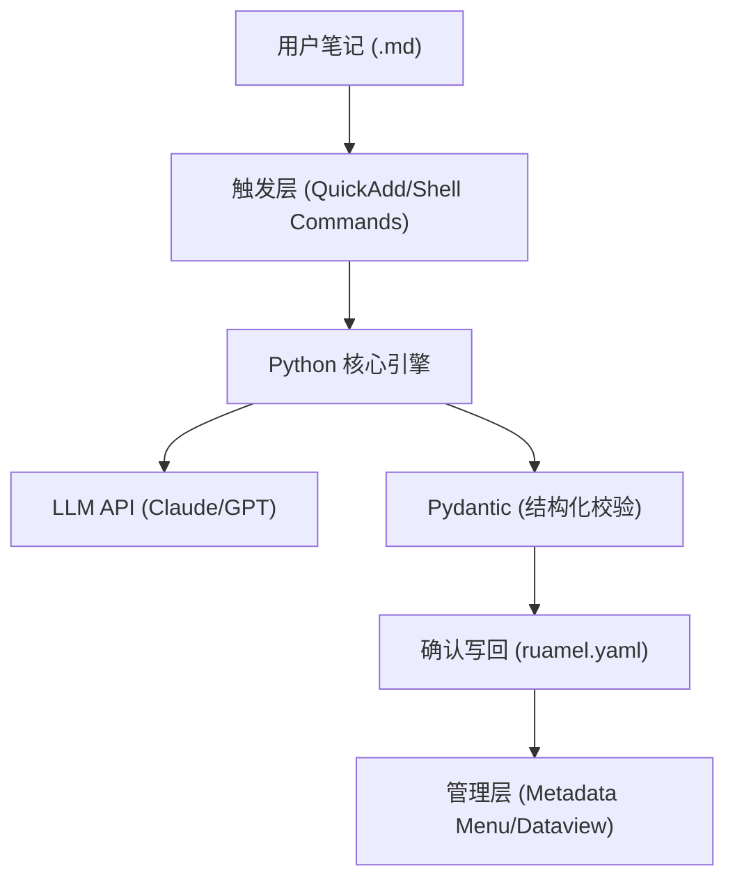

# 项目计划书：VaultMind - LLM 驱动的 Obsidian 知识整理助手

- **项目代号**：VaultMind
- **文档版本**：v3.0 (实施方案细化版)
- **日期**：2026年4月10日

---

## 1. 项目背景与核心诉求

用户在 Obsidian 中积累了大量零散笔记，但面临“整理压力”：
- **手动整理太累**：写完笔记后，手动提炼摘要、打标签、找关联非常耗时。
- **新手门槛**：作为 Obsidian 新手，不希望一开始就面对复杂的自动化流程，而是希望先看到清晰的整理结果。

**核心诉求**：
构建一个**手动触发**的智能助手，帮助用户快速理解笔记内容，并生成标准化的“内容标签”和“文件标签”，为后续构建知识体系打下基础。

---

## 2. 术语通俗解释 (面向新手)

为了方便理解，我们将 Obsidian 的一些概念对应到日常操作中：
- **Vault (仓库)**：就是你存放所有笔记的文件夹。
- **Properties (属性/元数据)**：笔记最上方的一块区域，用来存放标签、日期、摘要等“机器可读”的信息。
- **双链 (Internal Links)**：在笔记里用 `[[文件名]]` 建立的链接，点击可以直接跳转。
- **MOC (Map of Content)**：一个主题的“目录页”，比如“Python学习笔记”这个页面里链接了所有相关的 Python 笔记。

---

## 3. 技术路线比较与定案

在方案选型上，我们对比了三条路线：

| 维度 | 路线 A：纯外部 Python 脚本 | 路线 B：纯 Obsidian 插件 | **路线 C：混合架构 (定案)** |
| :--- | :--- | :--- | :--- |
| **开发难度** | 最低，标准文件 I/O | 较高，需学习 Obsidian API | 中，Python 核心 + 插件胶水 |
| **集成体验** | 弱，需切出编辑器运行 | 强，原生 UI 交互 | **好，通过插件触发 Python 逻辑** |
| **可维护性** | 高，逻辑解耦 | 中，受插件 API 更新影响 | **高，核心逻辑在 Python 中自研** |
| **适用场景** | 快速验证 Prompt 质量 | 追求极致原生体验 | **兼顾开发效率与用户体验** |

**最终定案**：采用**路线 C (混合架构)**。
- **Python 负责“大脑”**：处理 LLM 理解、摘要生成、标签分类、论文逻辑。
- **Obsidian 插件负责“肢体”**：负责命令触发、结果展示、元数据管理。

---

## 4. 技术栈选型与分工

### 4.1 技术栈分层架构



### 4.2 核心组件分工

- **Python 核心引擎**：
    - `Typer / argparse`：构建 CLI 接口。
    - `Pydantic`：定义结构化输出 Schema，确保标签和摘要格式稳定。
    - `ruamel.yaml`：安全地读写 Markdown 的 Frontmatter，保留用户原有注释和格式。
    - `httpx`：异步调用 LLM API。
- **Obsidian 插件分工 (插件优先边界)**：
    - **Shell commands / QuickAdd**：在 Obsidian 内一键调用 Python 脚本并传递当前文件路径。
    - **Dataview**：基于生成的 `vm_*` 标签，自动生成主题索引页和待办清单。
    - **Metadata Menu**：提供便捷的 UI 界面，方便用户人工微调 LLM 生成的标签。
    - **Linter**：在脚本写回后，自动规范化 Markdown 格式。

---

## 5. 核心功能设计

### 5.1 双层标签体系
我们将标签分为两类，通过 `Pydantic` 进行类型约束：
- **内容标签 (Content Tags)**：描述“讲了什么”。例如：`Transformer`、`深度学习`。
- **文件标签 (File Tags)**：描述“是什么”。
    - `知识点`、`思考`、`问题`、`摘录`。
    - `论文`：学术文献。

### 5.2 论文类文件处理策略 (正式规则)
针对 `vm_file_tags` 包含 `论文` 的文件，系统执行以下特殊逻辑：
1. **优先提取**：尝试从正文中定位 `Abstract` 或 `Summary` 章节，直接提取作为 `vm_summary`。
2. **关键词对齐**：提取原文 `Keywords`，仅在必要时由 LLM 进行中文翻译或标准化对齐。
3. **减少生成**：除非原文缺失摘要，否则 LLM 不进行“再创作”，以保持学术严谨性并节省 Token。

### 5.3 结构化输出协议 (Schema)
所有处理结果必须符合以下 YAML 格式：
```yaml
vm_summary: "3-5句核心摘要"
vm_content_tags: ["标签A", "标签B"]
vm_file_tags: ["性质A"]
vm_source_type: "note|paper|excerpt"
vm_status: "draft|reviewed|processed"
vm_processed_at: "ISO-8601 时间戳"
```

---

## 6. 实施阶段规划 (重构版)

### Phase 1：Python 核心引擎开发 (MVP)
- 实现 CLI 工具，支持读取单文件并输出符合 Schema 的结果。
- 完成针对“论文”和“普通笔记”的差异化 Prompt 调试。

### Phase 2：Obsidian 集成与写回
- 实现 `ruamel.yaml` 写回逻辑，支持“确认后写入”。
- 配置 `Shell commands` 插件，实现“一键整理当前笔记”。

### Phase 3：知识库管理增强
- 使用 `Dataview` 构建全局索引。
- 引入 `Metadata Menu` 管理标签词库。

### Phase 4：关联建议与自动化 (长期)
- 基于 `vm_summary` 的语义相似度推荐。
- 探索 `Local REST API` 实现更深度的自动化交互。

---

## 7. 风险控制与应对

- **插件依赖风险**：核心逻辑不依赖特定插件，若插件失效，Python 脚本仍可独立运行。
- **文件写回风险**：采用 `ruamel.yaml` 仅修改 Frontmatter 区域，写回前进行文件备份或 Git 暂存。
- **输出漂移风险**：通过 Pydantic 严格限制标签枚举值和摘要长度。
- **迁移风险**：所有元数据均存储在标准的 Markdown Frontmatter 中，不依赖私有数据库，方便未来迁移。

---

## 8. 验收示例

**输入 (论文类)**：
> Title: Attention Is All You Need
> Abstract: The dominant sequence transduction models are based on complex recurrent or convolutional neural networks...

**输出 (Properties)**：
```yaml
---
vm_summary: "该论文提出了 Transformer 架构，完全摒弃了递归和卷积，转而采用注意力机制，显著提升了序列转录模型的训练效率和性能。"
vm_content_tags:
  - "Transformer"
  - "Attention Mechanism"
vm_file_tags:
  - "论文"
vm_source_type: "paper"
vm_status: "processed"
vm_processed_at: "2026-04-10T10:30:00Z"
---
```
